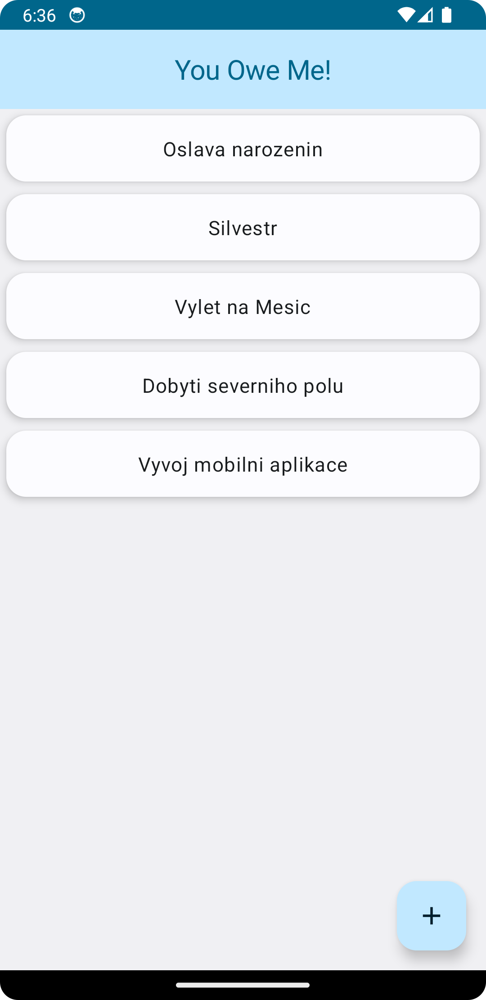
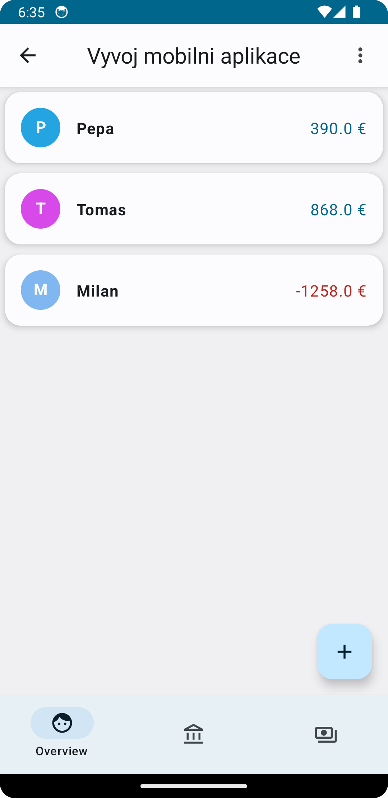
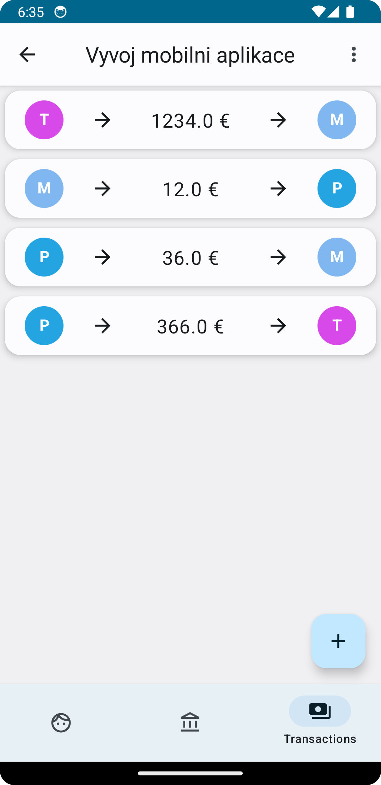
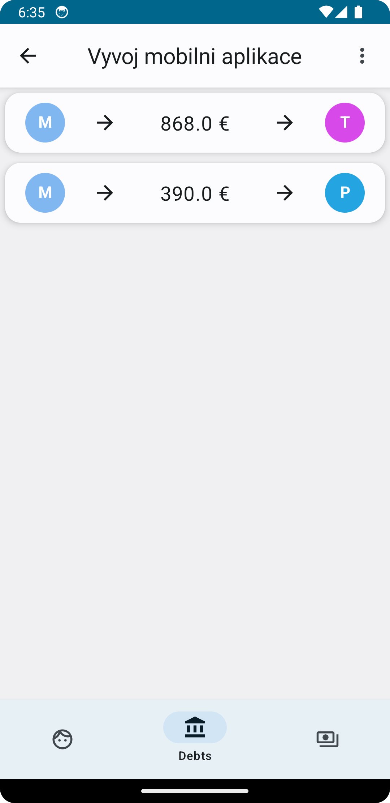

# You Owe Me!

## Overview

"You Owe Me!" is an financial app to track and settle debts between people.

## Features

Application works fully offline and does not require any internet connection.

### Debt Tracking
- Keep track of who owes you money and who you owe money to.

### Events 
- All debts are neatly organized into events.

### People Management
- Each event has a list of people who are involved and a list of debts that are owed.

### Settling Debts
- Settle debts after they have been paid.

### Balance
- Keep track of the balance of each person in each event.

## Screenshots

### Events

### Event Overview
Shows the list of people where you can add, edit and delete people.
And also shows their balance, based on the debts they owe and are owed.

### Transactions
Shows the list of transactions that were made in the event.

### Debts
Shows the list of minimized debts that are owed.

